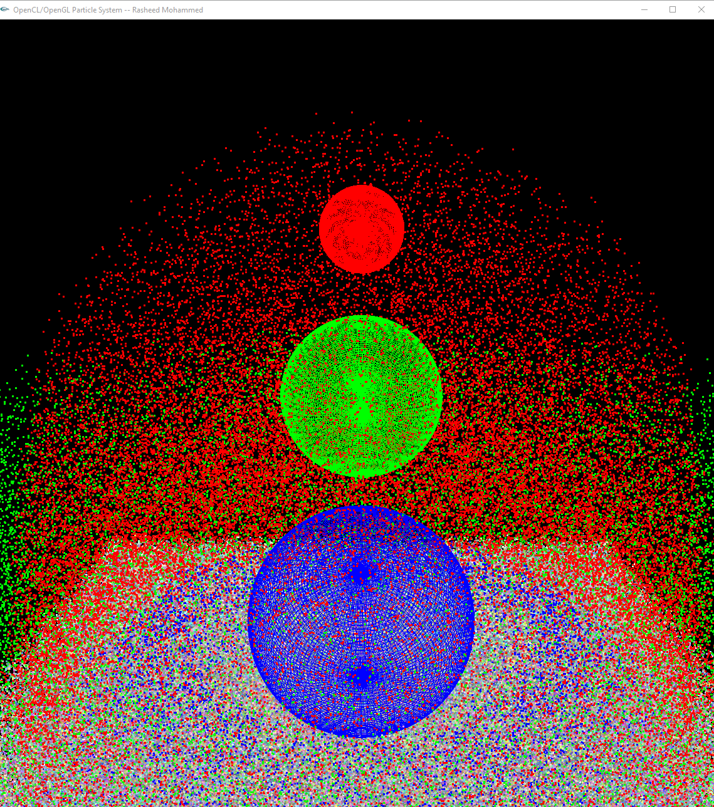

# Particle Effect Simulator with OpenCL

This C++ application harnesses the power of OpenCL and parallel programming, as well as OpenGL and GLUI to simulate a particle system where particles bounce off spheres and change colors upon impact. 

## Overview

- **Particle Simulation:** Particles are affected by gravity, and their position and velocity are updated each frame.
- **Sphere Interaction:** When a particle collides with a sphere, it bounces back and changes color. There are currently three spheres in the simulation, and each one assigns a different color to the particles upon contact (red, green, and blue).

## Simulation Demo




## File Structure

- `particles.cl`: The core OpenCL code responsible for the particle physics simulation. This file includes functions to determine particle-bounce dynamics against spherical surfaces and to update particle positions and velocities.
- `sample.cpp`: The core program file responsible for importing the various libraries needed and initiating the required graphics and UI using OpenGL and GLUI.

## Features

- Particle-sphere collision detection and bounce physics.
- Particles change color upon hitting specific spheres:
  - **Sphere 1:** Red
  - **Sphere 2:** Green
  - **Sphere 3:** Blue

## How to Run

1. Make sure you have the required dependencies:
    - A modern C++ compiler
    - OpenCL SDK
2. Clone the repository:
   ```
   git clone <repository-url>
   ```
3. Compile the project:
   ```
   make
   ```
4. Run the executable:
   ```
   ./particle_simulator
   ```

## particles.cl Breakdown

This OpenCL file contains various functions and a main kernel `Particle` which drives the simulation. 

- **Data Types:** Custom data types such as `point`, `vector`, `color`, and `sphere` are defined using `float4`.
  
- **Bounce:** Calculates the new vector for a particle after it bounces off a surface.
  
- **BounceSphere:** Utilizes the Bounce function specifically for spherical surfaces.
  
- **IsInsideSphere:** Checks if a given point (particle) is inside a sphere.

- **Particle (Kernel):** The main logic for particle movement and interaction with spheres.
  - Gravity (`G`) affects all particles.
  - Three spheres are defined (`Sphere1`, `Sphere2`, `Sphere3`), each with different positions and radii.
  - Particle position and velocity are updated based on gravity and collisions.
  - Particle color changes upon collision with any of the three spheres.

## Contributions

Pull requests are welcome! For major changes, please open an issue first to discuss the proposed change.

## License

MIT

---
